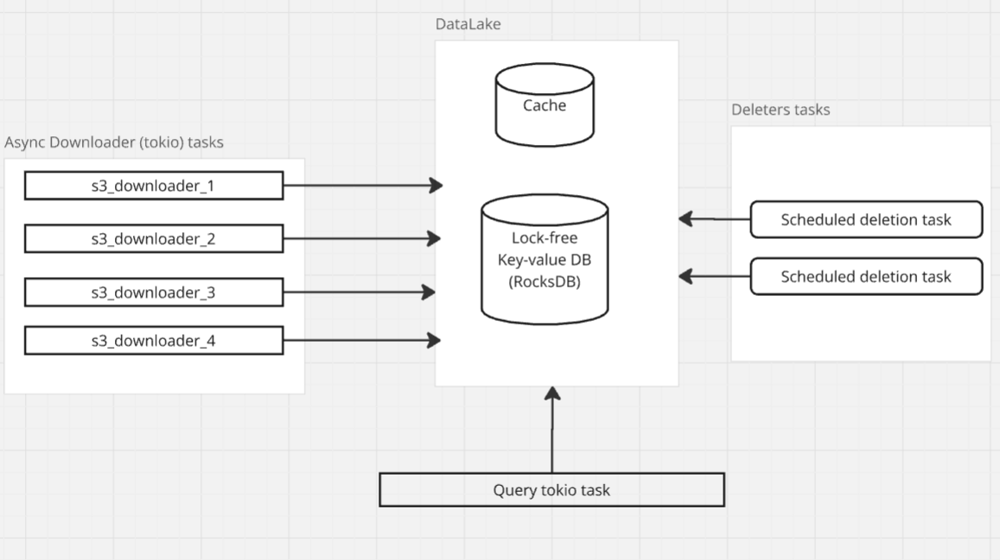

# datalake-worker
Data lake implementation integrated with AWS S3

# Supported features

- Async-Download chunks from AWS S3
- Persist on-disk in a lock-less manner
- List all persisted chunks by ID from a cache
- Find and lock a chunk - Once locked, chunk cannot be deleted until all DataChunkRef are dropped.
- Scheduled deletion - Scheduled for deletion, a chunk will be removed once it is no longer in use.

- Maximum allocated on-disk storage limit
- Backend-agnostic datamanager. The RocksDB backend can be substituted with any in-process NoSQL or SQL storage engine.g
- Simple Prompt UI

# Design 

# Datasource structure

### Cache - in-memory map of chunks IDs to a lock permit

| Chunk_ID    | Permit |
| -------- | ------- |
| 0x0A0B    |  0   |
| 0x0A0C    | 1    |
| 0x0A0C    | 0    |

### OnDisk Tables and Indexes

| Chunk_ID    | Encoded Chunk Data |
| -------- | ------- |
| 0x0A0B    |  0x..   |
| 0x0A0C    | 0x...    |
| 0x0A0C    | 0x    |

| DatasetID_BlockNum   | Chunk_ID |
| -------- | ------- |
| 100_0    | 0x0A0B   |
| 100_1    | 0x0A0B    |
| 100_2    | 0x0A0B    |

| Metadata    | Value |
 | ---------| -------- |
 0x1 (Size_Key)    | 2000000 |

